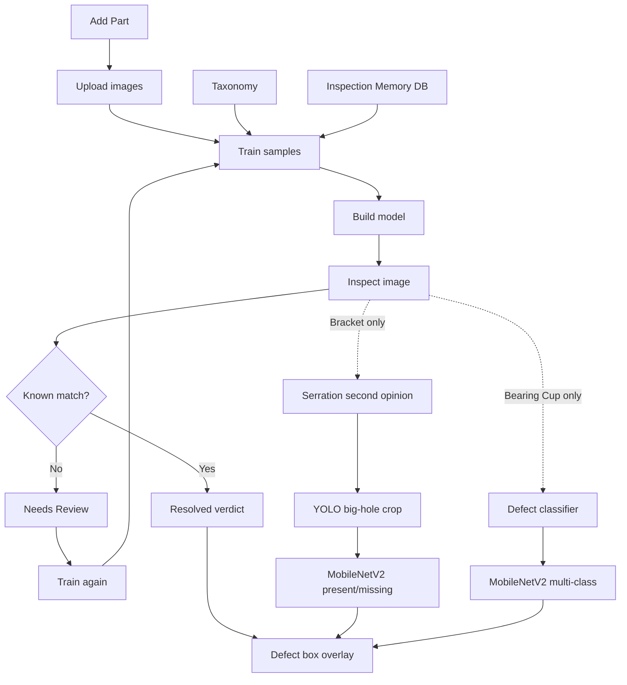

# QMSInspector

QMSInspector is an offline AI inspection system for manufactured parts. It learns from
human-reviewed sample images, stores them in a local inspection memory database, and
then checks new images entirely on the machine - **no cloud, no LLM, no API keys**.

Unlike generic object detectors, it is trained on your actual part-specific defects,
part types, and pass/fail decisions. If an image does not match a known pattern with
confidence, it is marked **Needs Review** and sent back for human review.

This is built for repeat part inspection: fast review of known defects, safe handling
of unfamiliar cases, and full local control of the quality process.

### Terminology

- `Part` - a specific component type being inspected, such as a Bearing Cup or Bracket.
- `Taxonomy` - the list of allowed defect labels or categories for a part.
- `Review` - a human-validated marking that defines what is good or defective on a sample image.
- `Train` - the process of adding reviewed sample images into the local memory so the system can recognize them later.
- `Needs Review` - the safe fallback state when the image does not match any known sample confidently.
- `Inspection Memory DB` - the local SQLite database that stores learned sample data and prior inspection history.
- `Model` - the packaged local model built from the learned data for offline inference.

### Workflow diagram



---

## How it works

```
 reviews/<part>.json --train--> data/inspection_memory.db --build--> models/best.pt
                                                                     |
                                            inspect (0 tokens) <-----+
                                                  |
                                RESOLVED (annotated verdict)  or  Needs Review
                                                                      |
                                             copied to  needs_review/  for retraining
```

* **train** - reads every `reviews/<part>.json` file, validates each human marking
 against the active taxonomy, extracts per-image feature vectors and perceptual hashes,
 and stores the approved training records in `data/inspection_memory.db`.
* **build** - loads the trained records from the database, rebuilds the normalized
 feature matrix and taxonomy metadata, and writes the packed inference artifact to
 `models/best.pt`.
* **inspect** - loads `best.pt`, extracts the feature vector and perceptual hash from
 an input image, performs local recall against stored reference entries, and returns
 either a resolved verdict with defect overlays or a `Needs Review` result. Images that
 fail recall are copied into `needs_review/` for later retraining.

For **Bracket** parts the inspector adds a trained *serration second opinion*: a small
MobileNetV2 classifier decides whether the serration teeth on the big splined hole are
present or missing. Because recall only recognises near-duplicates, this classifier is
what lets a *never-seen* bracket photo still get a serration verdict. To stay honest it
looks **only at the big hole**: a trained YOLO detector localises that hole (any
orientation), the image is cropped to it, and only the crop is classified - so part
colour or body markings cannot leak into the decision. This part-specific code lives
under `parts/bracket/` (see below).

For **Bearing Cup** parts the inspector adds a trained *defect classifier*: a MobileNetV2
model that predicts the defect type (`Corrosion`, `Dent`, `Edge Cut`, `Missing Punch`,
`Out-of-Round`) or `OK`. It is trained with full rotation/flip augmentation so it works at
any orientation, letting a *never-seen* bearing-cup photo still get a verdict. This
part-specific code lives under `parts/bearing_cup/` (see below).

Inspection never calls any external service.

---

## Install

```powershell
pip install -r requirements.txt
```

> **Deploying on a Raspberry Pi?** See the beginner step-by-step guide in
> [`RASPBERRY_PI.md`](RASPBERRY_PI.md) (64-bit Pi OS, CPU PyTorch, run as a service,
> view results in a browser).


## Usage

```powershell
# 1. train from the review files (idempotent - skips already-learned images)
python qms.py train

# 2. build the packed model
python qms.py build

# 3. inspect an image or a folder (annotated outputs in inspect_out/)
python qms.py inspect "C:\path\to\image.jpg"
python qms.py inspect "C:\path\to\folder"

#    Needs Review images are copied to ./needs_review by default:
python qms.py inspect "C:\path\to\folder" --needs-review-dir "C:\to_review"
python qms.py inspect "C:\path\to\folder" --no-collect      # don't copy

# summary of what has been learned
python qms.py stats
```

The inspection state is grouped under `inspection_state/`:

```text
inspection_state/
  data/
  knowledge/
  models/
  reviews/
```


### REST API (also offline)

```powershell
python qms.py serve --port 8000
```

### Startup helper

If you want a one-command reset, use:

```bash
./start.sh
```

That deletes previous `inspection_jobs/*` output and starts the server on port `8000`.
To install dependencies first, opt in explicitly:

```bash
./start.sh --install
```

On Windows, use:

```powershell
.\start.bat
```

Or with optional dependency install:

```powershell
.\start.bat --install
```

| Method | Path       | Purpose                                             |
|--------|------------|-----------------------------------------------------|
| GET    | `/health`  | service status + counts                             |
| POST   | `/inspect` | inspect an uploaded image; returns the JSON verdict |
| POST   | `/learn`   | train a label at runtime (image + label)            |
| GET    | `/parts`   | learned parts + their defect categories             |
| GET    | `/stats`   | counts + recent inspections                         |

---

## Reviewing new images

For every image dropped in `needs_review/`, add an entry to the matching
`inspection_state/reviews/<part>.json` (mark OK, or the defect + its box/polygon), then re-run:

```powershell
python qms.py train
python qms.py build
```

The next inspection of that image (or a near-duplicate) resolves instantly with
zero tokens.

To add a **new part**, create `inspection_state/reviews/<new_part>.json` (human
markings, same schema) and one rule file `inspection_state/knowledge/rules/<new_part>.json`
that defines the part's defects (name, severity, color, signature),
confirmed rulings and confusions - all in that single file. Then run
`python qms.py train` and `python qms.py build`. No code changes needed.

---

## Part-specific models (`parts/`)

Some defects cannot be judged by recall alone and need a small trained model. That
part-specific code lives under `parts/<part_name>/` so it stays separate from the
generic engine in `inspector/`.

### Bracket - serration detection

`parts/bracket/` holds the serration present/missing feature:

- `holes.py` - localises the big splined hole (trained YOLO detector, with Hough +
  whole-image fallbacks) and crops to it.
- `serration.py` - MobileNetV2 classifier that reads only the big-hole crop and
  returns present/missing. `inspector/recognizer.py` calls this for Bracket parts and
  raises a `Serration Missing` defect when the rim is smooth.
- `train_serration.py` - offline trainer for the classifier.
- `train_big_hole_yolo.py` - offline trainer for the big-hole detector (hand-annotated
  boxes are embedded in the script as the source of truth).

The two trained artifacts are `inspection_state/models/serration_bracket.pt` and
`inspection_state/models/big_hole_yolo.pt`. Both load lazily and degrade gracefully -
if a weights file or a dependency (torch / ultralytics) is missing, serration is simply
skipped and the rest of the pipeline is unaffected.

To retrain after adding new bracket images (update the label / box tables at the top of
each script first):

```powershell
# cross-validation report (no save)
python parts/bracket/train_serration.py

# retrain the big-hole detector -> models/big_hole_yolo.pt
python parts/bracket/train_big_hole_yolo.py --train

# retrain + save the serration classifier -> models/serration_bracket.pt
python parts/bracket/train_serration.py --final
```

### Bearing Cup - defect classifier

`parts/bearing_cup/` holds a trained multi-class defect classifier that recognises
bearing-cup defects at any orientation:

- `defect.py` - MobileNetV2 classifier that predicts one of
  `Corrosion / Dent / Edge Cut / Missing Punch / Out-of-Round` or `OK`.
  `inspector/recognizer.py` calls this for Bearing Cup parts and raises the matching
  defect when a non-OK class wins above the threshold. It is a second opinion on top of
  recall, so a *never-seen* bearing-cup photo (or one at an arbitrary angle) can still get
  a verdict, unlike perceptual-hash recall which only matches stored orientations.
- `train_defect.py` - offline trainer. Uses full 0-360 degree rotation + flip
  augmentation so the model tolerates any orientation, not just 0/90/180/270.
- `rotation_augment.py` - helper to generate rotated/flipped image variants for training.

The trained artifact is `inspection_state/models/bearing_cup_defect.pt`. It loads lazily
and degrades gracefully - if the weights or torch are missing, the bearing-cup opinion is
skipped and the rest of the pipeline is unaffected.

> **Important - preprocessing must match training.** `train_defect.py` feeds the model the
> **whole resized image** (no crop, no background flatten). `defect.py` therefore does the
> same at inference. Cropping or segmenting at inference only (a mismatch) makes the model
> see an out-of-distribution input and predict unreliably.
>
> **Data caveat.** The classifier is only as good as its labelled data. With just a few
> real parts per class it will *memorise* rather than generalise, and can be confidently
> wrong on new photos. Collect more varied real images per defect type to improve it, and
> keep the `reviews/bearing_cup.json` labels correct - a wrong label trains a wrong answer.

To retrain after adding new bearing-cup images (labels come from
`inspection_state/reviews/bearing_cup.json`):

```powershell
# 3-fold cross-validation report (no save)
python parts/bearing_cup/train_defect.py

# retrain + save the classifier -> models/bearing_cup_defect.pt
python parts/bearing_cup/train_defect.py --final
```

---

## Layout

```
qms.py                     single CLI (train | build | inspect | serve | stats)
inspector/
  settings.py              paths + tunables (env-overridable)
  taxonomy.py              central parts/defects/severity/colors loader
  part_rules.py            loads the per-part rule files (rules/<part>.json)
  image_features.py        OpenCV feature extraction + perceptual hash
  knowledge_base.py        SQLite inspection memory + knowledge cache
  renderer.py              draws defect masks / labels / banners
  recognizer.py            offline packed-model recall (the inspect engine)
  model_builder.py         packs everything into inspection_state/models/best.pt
  trainer.py               trains all parts from inspection_state/reviews/
  live_classifier.py       kNN + rule engine used by the REST API
  live_trainer.py          runtime add/correct used by the REST API
  web_api.py               Flask REST server (offline)
parts/                     per-part specialized modules (layered on inspector/)
  bracket/
    holes.py               locate + crop the big splined (serration) hole
    serration.py           serration present/missing classifier (used by recognizer)
    train_serration.py         (re)train the serration classifier on big-hole crops
    train_big_hole_yolo.py     (re)train the YOLO big-hole detector used for cropping
  bearing_cup/
    defect.py              multi-class bearing-cup defect classifier (used by recognizer)
    train_defect.py            (re)train + save the bearing-cup defect classifier
    rotation_augment.py        generate rotated/flipped image variants for training
inspection_state/
  knowledge/              rules/<part>.json (one file per part), corrections.json
  reviews/                 bearing_cup.json, bracket.json (human markings)
  models/best.pt           the packed model
  models/serration_bracket.pt  Bracket serration classifier (MobileNetV2)
  models/big_hole_yolo.pt      Bracket big-hole detector (YOLO, for cropping)
  models/bearing_cup_defect.pt Bearing Cup defect classifier (MobileNetV2)
  data/inspection_memory.db durable learned memory
```

### Folder purpose summary

- `inspection_state/` - the grouped inspection state bundle
- `inspection_state/data/` - local runtime data, including the main SQLite database
- `inspection_state/data/inspection_memory.db` - durable learning memory and prior inspection history
- `inspection_state/reviews/` - human-reviewed sample annotations for each part
- `inspection_state/knowledge/` - per-part rule files (`rules/<part>.json`: defects, severity, rulings) and training guidance
- `inspection_state/models/` - built inspection model package used for offline inference
- `parts/` - part-specific modules and trainers layered on the generic engine (e.g. Bracket serration)
- `inspect_out/` - generated annotated inspection outputs
- `needs_review/` - images that did not match confidently and need human review

All inspection is local and free. The only durable state you need to keep is
`inspection_state/data/inspection_memory.db`, `inspection_state/models/best.pt`,
`inspection_state/reviews/`, and `inspection_state/knowledge/`. If you use the Bracket
serration feature, also keep `inspection_state/models/serration_bracket.pt` and
`inspection_state/models/big_hole_yolo.pt` (or retrain them via `parts/bracket/`). If you
use the Bearing Cup defect classifier, also keep
`inspection_state/models/bearing_cup_defect.pt` (or retrain it via `parts/bearing_cup/`).

## Release snapshot

This project treats the reviewed data and taxonomy as the source of truth, while
`inspection_state/data/inspection_memory.db` and `inspection_state/models/best.pt`
are generated runtime artifacts. To save a versioned inspection state for later
recovery, create a release snapshot:

```powershell
python release_snapshot.py --tag v2026-09-14
```

This writes a snapshot under `releases/<tag>/` with a JSON manifest containing
SHA256 hashes for the current reviews, taxonomy, database, and model. The snapshot
also stores the current runtime state as an archived bundle so you can restore a
known-good state later.

### Release snapshot policy

Create a snapshot when the inspection state materially changes, such as:

- new or removed part definitions
- taxonomy or defect-label updates
- review corrections or added evidence samples
- retraining or any DB/model regeneration
- a pre-demo or release-candidate checkpoint
- any state that must be recoverable before risky changes

Do not create a snapshot for purely cosmetic edits or temporary experiments that
are not meant to be preserved.

A practical rule is: if the system could behave differently after the change,
create a release snapshot.
