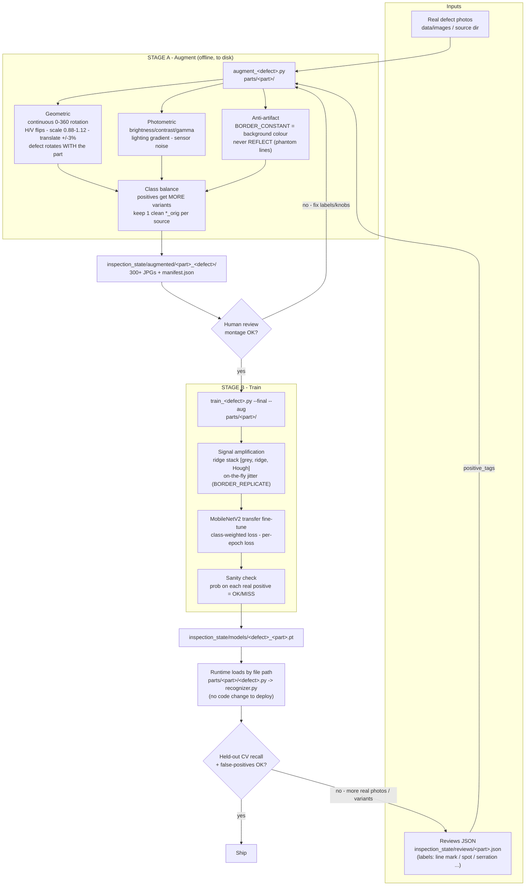
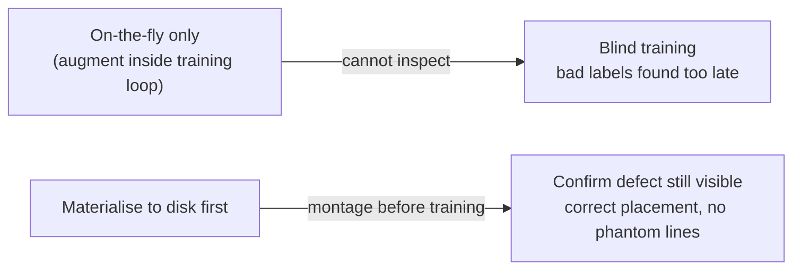

# Augmentation Pipeline (visual overview)

> Companion diagram for [`augmentation_training_skill.md`](./augmentation_training_skill.md).
> That doc is the authoritative recipe; this page is the picture. Use it to onboard
> quickly to **how a new per-defect classifier is produced** — from real photos to a
> deployed `.pt` that the runtime loads automatically.

The pipeline is deliberately **two-stage** (augment to disk, then train) so a human can
**eyeball the augmented images before spending time training** — the defect must still be
visible and correctly placed after every rotation and lighting change.

---

## End-to-end flow

---

## Why two stages (and to disk)

- **Materialising to disk** lets us show the user a montage (one sample per positive
  source) and get an explicit OK *before* training.
- Augmented sets are **regenerable**, so they are **not committed** to git
  (`inspection_state/augmented/` is gitignored). Re-run the augmenter to rebuild them.

---

## Reference implementations

| Stage | Bracket line-mark | Bearing-cup |
|-------|-------------------|-------------|
| Augment | `parts/bracket/augment_line_mark.py` | `parts/bearing_cup/rotation_augment.py` |
| Train | `parts/bracket/train_line_mark.py --final --aug` | `parts/bearing_cup/train_defect.py --final --aug` |
| Output set | `inspection_state/augmented/bracket_line_mark/` | `inspection_state/augmented/bearing_cup_aug/` |
| Model | `inspection_state/models/line_mark_bracket.pt` | `inspection_state/models/<defect>_bearing_cup.pt` |

For the full checklist (exact augmentation knobs, trainer expectations, and the runbook
for adding a brand-new defect) see **[`augmentation_training_skill.md`](./augmentation_training_skill.md)**.
