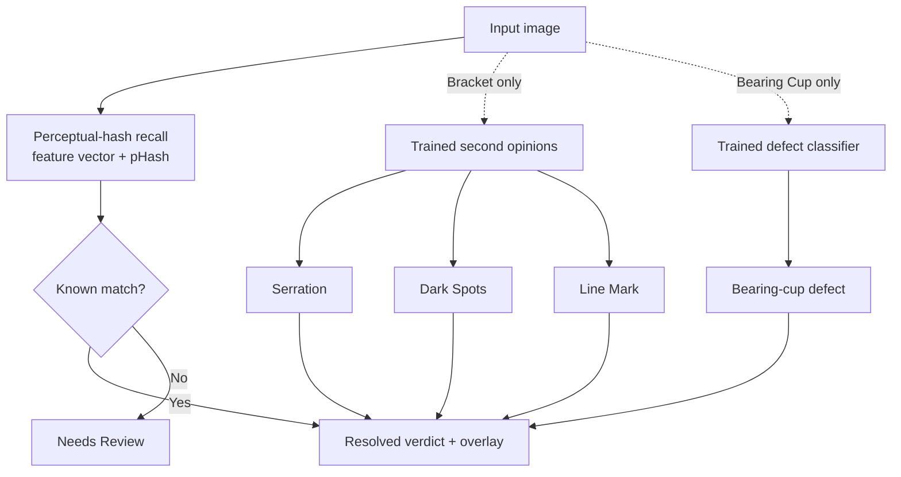
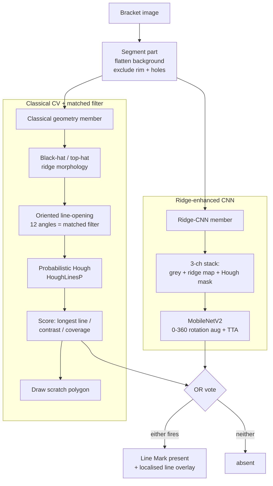
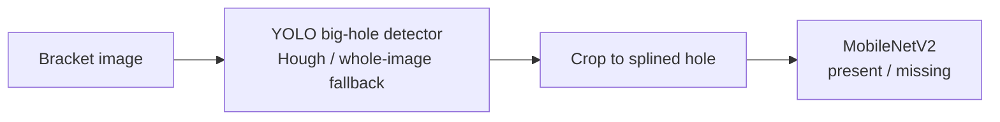

# Detection strategy (how each defect is actually decided)

QMSInspector does **not** use one model for everything. Every image first goes
through **perceptual-hash recall** (the generic engine). On top of that, each part
runs **trained second opinions** that are tuned to the *physics* of the defect -
some are deep-learning classifiers, and one (line mark) is a **classical
computer-vision + matched-filter** pipeline ensembled with a CNN.

This file documents exactly which technique decides each defect so anyone can see
the strategy at a glance.

## Strategy per defect

| Defect | Part | Decider | Techniques used |
|--------|------|---------|-----------------|
| *(any known match)* | all | **Perceptual-hash recall** | OpenCV feature vector + pHash nearest-neighbour against learned reviews |
| **Serration missing** | Bracket | **YOLO localise → CNN classify** | YOLO big-hole detector (Hough-circle / whole-image fallback) crops the splined hole; **MobileNetV2** classifies present/missing on the crop only |
| **Dark Spots** | Bracket | **CNN (whole part)** | **MobileNetV2** on the segmented part (background flattened) with rotation/flip **test-time augmentation** → any-angle |
| **Line Mark** | Bracket | **Ensemble: classical CV *OR* ridge-CNN** (OR-vote) | **Classical:** background flatten + rim/hole exclusion → **black-hat/top-hat ridge morphology** (matched filter for thin lines) → **oriented line-opening** at 12 angles (matched filter) → **probabilistic Hough** (`HoughLinesP`) → longest-line length + contrast + coverage scoring, and it *draws* the scratch as a thin polygon. **CNN:** MobileNetV2 on a 3-channel **[grey, ridge map, Hough line mask]** stack, full 0-360 rotation aug |
| **Bearing-cup defects** (Corrosion / Dent / Edge Cut / Missing Punch / Out-of-Round / OK) | Bearing Cup | **Multi-class CNN** | **MobileNetV2** on the whole resized image with rotation/flip **test-time augmentation** → any-angle, 6 classes |

> A trained detector, when it fires, **owns the verdict and the overlay**; the
> stored review polygon is only a fallback used when the model misses.

## Pipeline overview

## Line Mark - the classical + matched-filter + Hough ensemble

Line marks are thin scratches that a plain CNN loses when the part is downscaled to
224 px. So line mark uses **two members that fail on different parts** and vote with
**OR** (a scratch is flagged when *either* fires):

**Why this design:** with only ~5 labelled line-mark examples, a single model is
unreliable. The classical member is **rotation-invariant by construction** and can
draw a tight line; the CNN generalises to faint marks the geometry misses. Together
(leave-one-out) they catch 4/5 real line marks while keeping false alarms low.

## Serration - localise then classify

Cropping to the big hole first keeps the decision **honest** - part colour or body
markings cannot leak into the serration verdict.

## Dark Spots & Bearing Cup - CNN classifiers

Both are **MobileNetV2** classifiers trained with full rotation/flip augmentation and
averaged over several augmented views at inference (**test-time augmentation**), so
they work at any orientation - unlike recall, which only matches stored angles.

- **Dark Spots (Bracket):** binary present/absent on the segmented, background-flattened part.
- **Bearing Cup:** 6-way `Corrosion / Dent / Edge Cut / Missing Punch / Out-of-Round / OK` on the **whole resized image** (inference preprocessing must match training - no crop).

## Not model-backed (recall only)

Some taxonomy labels have **no trained detector** and only surface from stored review
geometry when a near-duplicate image is uploaded:

- **Dark Marks** - only 1 labelled example; the Dark **Spots** model filters strictly
  on category `"Dark Spots"`, so "Dark Marks" is *not* learned by any model.
- Other rare categories (e.g. White Mark, Incomplete/Shallow Embossing) - recall only.

These are flagged only on known images/near-duplicates, not on genuinely new photos.
